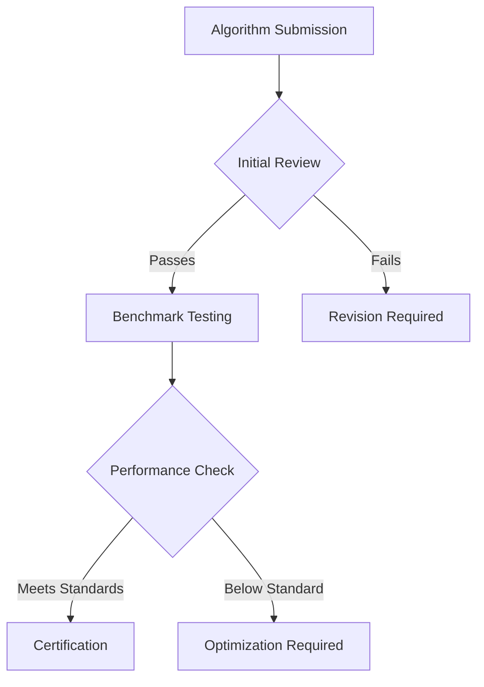

# Quantum-Inspired Algorithm Development Platform (QADP)

## System Architecture

A decentralized platform for developing, validating, and deploying quantum-inspired optimization algorithms with robust benchmarking and governance.

### Core Components

#### 1. Algorithm Management System
```
├── Algorithm Registry
│   ├── Version Control
│   │   ├── Implementation History
│   │   └── Performance Tracking
│   └── Dependency Management
├── Benchmarking Framework
│   ├── Standard Test Suites
│   └── Performance Metrics
└── Deployment Pipeline
    ├── Integration Tests
    └── Production Validation
```

#### 2. Smart Contract Infrastructure
```solidity
contract AlgorithmRegistry {
    struct Algorithm {
        uint256 algorithmId;
        bytes32 codeHash;
        address developer;
        uint16 version;
        string[] problemClasses;
        bool verified;
    }
    
    struct Benchmark {
        uint256 benchmarkId;
        uint256 algorithmId;
        uint256[] performanceMetrics;
        uint32 complexity;
        bool certified;
    }
    
    mapping(uint256 => Algorithm) public algorithms;
    mapping(uint256 => Benchmark) public benchmarks;
}
```

### Testing Framework

#### 1. Problem Classes
- Combinatorial Optimization
- Continuous Optimization
- Mixed-Integer Programming
- Constraint Satisfaction
- Network Optimization

#### 2. Performance Metrics
```
Algorithm Score = (Solution Quality * Speed Factor) / Resource Usage
Efficiency Rating = ∑(Problem Class Performance) * Scalability Factor
```

### Implementation Details

#### Quantum-Inspired Components
1. Core Mechanisms
    - Quantum Superposition Simulation
    - Entanglement-Inspired Variables
    - Quantum Walk Adaptations

2. Classical Integration
    - Hybrid Execution Models
    - Resource Optimization
    - Performance Scaling

#### Development Environment
```
├── Core Framework
│   ├── Algorithm Templates
│   ├── Testing Harness
│   └── Performance Profiler
├── Integration Tools
│   ├── Quantum Simulator
│   └── Classical Backend
└── Deployment Systems
    ├── Container Management
    └── Resource Allocation
```

### Governance Structure

#### Algorithm Validation Process
1. Submission Phase
    - Code review
    - Documentation check
    - Initial benchmarking

2. Certification Phase
    - Peer review
    - Performance validation
    - Security audit

#### Quality Control


### Economic Model

#### Token Utility
- QOPT (Quantum Optimization) governance token
- Compute resource credits
- Algorithm licensing rights

#### Marketplace Dynamics
```
Algorithm Value = Base Price * (Performance Rating + Uniqueness Factor)
Resource Cost = Compute Units * Complexity Factor * Time Used
```

### Collaborative Features

#### Development Tools
1. Code Management
    - Version control integration
    - Automated testing
    - Documentation generation

2. Collaboration Systems
    - Code review platform
    - Discussion forums
    - Knowledge base

### Benchmarking Standards

#### 1. Standard Problem Sets
- Traveling Salesman Problem
- Maximum Cut Problem
- Portfolio Optimization
- Vehicle Routing
- Job Shop Scheduling

#### 2. Evaluation Criteria
```
Evaluation Matrix:
- Solution Quality
- Convergence Speed
- Resource Efficiency
- Scalability
- Robustness
```

### Security Measures

#### 1. Code Validation
- Static analysis
- Dynamic testing
- Vulnerability scanning

#### 2. Access Control
- Multi-signature approval
- Role-based permissions
- Audit logging

### Future Development

#### Phase 1: Core Platform
- Basic algorithm registry
- Standard benchmarks
- Initial governance

#### Phase 2: Enhancement
- Advanced testing tools
- Extended problem classes
- Improved analytics

#### Phase 3: Ecosystem Growth
- Integration APIs
- Custom benchmarks
- Advanced governance

## Technical Specifications

### Performance Requirements
1. Algorithm Execution
    - Runtime efficiency
    - Memory utilization
    - Solution quality

2. Platform Operations
    - Transaction throughput
    - Response latency
    - Resource allocation

### Integration Capabilities

#### 1. External Systems
- Classical computing platforms
- Quantum simulators
- Cloud resources

#### 2. API Framework
```
├── Core APIs
│   ├── Algorithm Submission
│   ├── Benchmark Execution
│   └── Result Validation
└── Integration Points
    ├── External Compute
    └── Data Exchange
```

## Implementation Guidelines

### Development Standards
1. Code Quality
    - Style guidelines
    - Documentation requirements
    - Test coverage

2. Performance Criteria
    - Execution efficiency
    - Resource utilization
    - Solution quality

### Deployment Process
1. Testing Pipeline
    - Unit tests
    - Integration tests
    - Performance validation

2. Release Protocol
    - Version control
    - Documentation
    - Deployment verification

## Conclusion

The Quantum-Inspired Algorithm Development Platform provides a robust environment for developing, testing, and deploying optimization algorithms while maintaining high standards for quality and performance.
